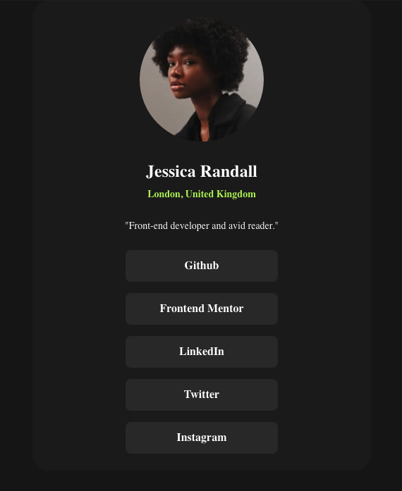

# Frontend Mentor - Social links profile solution

This is a solution to the [Social links profile challenge on Frontend Mentor](https://www.frontendmentor.io/challenges/social-links-profile-UG32l9m6dQ). Frontend Mentor challenges help you improve your coding skills by building realistic projects.

## Table of contents

- [Overview](#overview)
  - [The challenge](#the-challenge)
  - [Screenshot](#screenshot)
  - [Links](#links)
- [My process](#my-process)
  - [Built with](#built-with)
  - [What I learned](#what-i-learned)
  - [Continued development](#continued-development)
  - [Useful resources](#useful-resources)
- [Author](#author)
- [Acknowledgments](#acknowledgments)

## Overview

- A small social links card with name and anchor tags.

### The challenge

Users should be able to:

- See hover and focus states for all interactive elements on the page

### Screenshot



### Links

- [Check out the code here](https://github.com/John-Davidson-8/fem-social-links-profile-main)
- [Check out the site here](https://fem-social-links-profile-main.netlify.app/)

## My process

- My process was to start mobile first using CSS Flexbox. Flex-direction was column and also made another Flex container for the anchor tags.

### Built with

- Semantic HTML5 markup
- CSS custom properties
- Flexbox
- Mobile-first workflow

### What I learned

I learned how to use Figma more appropriately. Learning the basics of Figma I feel is vital moving forward.

Below is how I arranged my Flex container for anchor tags. The CSS below that highlights how I styled the anchor tags.

```html
<div class="social-links">
  <a href="#" class="links">Github</a>
  <a href="#" class="links">Frontend Mentor</a>
  <a href="#" class="links">LinkedIn</a>
  <a href="#" class="links">Twitter</a>
  <a href="#" class="links"> Instagram</a>
</div>
```

```css
a {
  color: var(--secondary-1-white);
  font-weight: 700;
  text-align: center;
  line-height: 1.31rem;
  text-decoration: none;
  padding: 0.75rem 3rem;
  background-color: var(--secondary-2-grey);
  border-radius: 0.5rem;
}
```

### Continued development

General layout principles even for the most basic project helps my learning.

### Useful resources

- (https://developer.mozilla.org/en-US/docs/Web/CSS/CSS_Flexible_Box_Layout/Typical_Use_Cases_of_Flexbox#form_controls) - This helped me for understanding typical use cases for Flexbox.
- (https://www.youtube.com/watch?v=u044iM9xsWU&t=1s) - This is an amazing short video by Kevin Powell on Flexbox. He has many excellent tutorials on CSS.

## Author

- Frontend Mentor - [@John-Davidson-8](https://www.frontendmentor.io/profile/John-Davidson-8)
- Github (https://github.com/John-Davidson-8)
